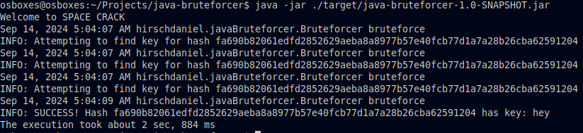

# Readme: Java Bruteforcer

This is a Java-based bruteforcing library which supports different bruteforcing algorithms:

1. Pure bruteforce. Discovers the password / key by trying all possible combinations, given a set of available characters to try. Potentially takes a very long time unless the password is of low strength.
2. Dictionary attack. Discovers the password / key by trying all available entries from a given dictionary file. A sample dictionary file is available in `src/resources`. Very fast, but requires a common password to work. Simple passwords this method cracks quickly are (for example) `spiderman`. It's usually clever to try this method first to eliminate the off-chance that the password to be discovered is a simple one.
3. Advanced dictionary attack. This method attempts to discover the password by trying all dictionary entries plus their manipulations, e.g. manipulating letter cases and appending numbers and special characters. For example, the advanced dictionary attack is capable of discovering a password such aas `SpiderMan09`.

### Speed
Multithreading allows passwords to be discovered more quickly by launching concurrent bruteforcing processes.

### Usage

Compile the project using maven.

```bash
# Clone this git repo
git clone <this-project-URL>

# Compile
mvn clean install

# Run the generated jar file for a sample bruteforcing attack
java -jar ./target/java-bruteforcer-1.0-SNAPSHOT.jar
```

Sample screenshot of execution:


The main method contains a sample bruteforcing attack, which allows you to see how the bruteforcer is used as a library. To launch your custom attack, you can modify the main method, or access the library code programmatically.
